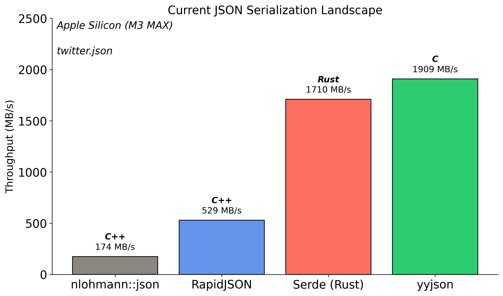

# C++26 Reflection for JSON Serialization
## A Practical Journey

- Daniel Lemire, *University of Quebec* :canada:
- Francisco Geiman Thiesen :brazil:, *Microsoft* :us:

CppCon 2025


---

# JSON

- Portable, simple
- Used by ~97% of API requests. [Landscape of API Traffic 2021 - Cloudflare](https://blog.cloudflare.com/landscape-of-api-traffic/#:~:text=We%20begin%20by%20examining%20the,first%20week%20of%20February%202021)
- scalar values
  - strings (must be escaped)
  - numbers (but not `NaN` or `Inf`)
- composed values
  - objects (key/value)
  - arrays (list)


---

```json
{
    "username": "Alice",
    "level": 42,
    "health": 99.5,
    "inventory": ["sword", "shield", "potion"]
}
```

---

# JSON downside?

Reading and writing JSON can be *slow*. E.g., 20 MB/s to 200 MB/s.

- Slower than fast disks or fast networks


---


Source: Gwen (Chen) Shapira


---


---

# Performance

- simdjson was the first library to break the gigabyte per second barrier
    * Parsing Gigabytes of JSON per Second, VLDB Journal 28 (6), 2019
    * On-Demand JSON: A Better Way to Parse Documents? SPE 54 (6), 2024
- JSON for Modern C++ can be $100\times$ slower!


---


## SIMD

- Stands for Single instruction, multiple data
- Allows us to process 16 (or more) bytes or more with one instruction
- Supported on all modern CPUs (phone, laptop)

---

# Superscalar vs. SIMD execution

| processor       | year    | arithmetic logic units    | SIMD units     | simdjson |
|-----------------|---------|---------------------------|----------------|----------|
| Apple M*       |  2019   |    6+                      | $4 \times 128$ | 🥉        |
| Intel Lion Cove       |  2024   |    6                | $4 \times 256$ | 🥈🥈        |
| AMD Zen 5       |  2024   |    6                      | $4 \times 512$ | 🥇🥇🥇        |

---

# SIMD support in simdjson

- x64: SSSE3 (128-bit), AVX-2 (256-bit), AVX-512 (512-bit)
- ARM NEON
- POWER (PPC64)
- Loongson: LSX (128-bit) and LASX (256-bit)
- RISC-V: *upcoming*

---

# simdjson: Parsing design

- First scan identifies the structural characters, start of all strings at about 10 GB/s using SIMD instructions.
- Validates Unicode (UTF-8) at 30 GB/s.
- Rest of parsing relies on index.
- Allows fast skipping.

---


https://openbenchmarking.org/test/pts/simdjson


---

# Usage

The simdjson library is found in...

- Node.js
- ClickHouse
- Velox
- Milvus
- QuestDB
- StarRocks
- ...


---

# Conventional JSON parsing (DOM)

Start with JSON.
```json
{"name":"Scooby", "age": 3, "friends":["Fred", "Daphne", "Velma"]}
```

Parses (everything) to Document-Object-Model:


Copies to user data structure.


---

# Limitations of conventional parsing

- Tends to parse everything at once even when not needed.
- Requires an intermediate data structure (DOM).
- Can't specialize (e.g., treat `"123"` as a number)


--

# On-Demand

Can load a multi-kilobyte file and only parse a narrow segment from a fast index.

```cpp
#include <iostream>
#include "simdjson.h"
using namespace simdjson;
int main(void) {
    ondemand::parser parser;
    padded_string json = padded_string::load("twitter.json");
    ondemand::document tweets = parser.iterate(json);
    std::cout << uint64_t(tweets["search_metadata"]["count"]) << " results." << std::endl;
}
```


---

# Automate the serialization/deserialization process.


---

# The Problem

Imagine you're building a game server that needs to persist player data.


---

You start simple:

```cpp
struct Player {
    std::string username;
    int level;
    double health;
    std::vector<std::string> inventory;
};
```


---

# The Traditional Approach: Manual Serialization

Without reflection, you may write this tedious code:

```cpp
// Serialization - converting Player to JSON
fmt::format(
        "{{"
        "\"username\":\"{}\","
        "\"level\":{},"
        "\"health\":{},"
        "\"inventory\":{}"
        "}}",
        escape_json(p.username),
        p.level,
        std::isfinite(p.health) ? p.health : -1.0,
        p.inventory| std::views::transform(escape_json)
);
```

---

# With a library (JSON for Modern C++)

Or you might use a library.

```cpp
std::string to_json(Player& p) {
  return nlohmann::json{{"username", p.username},
                        {"level", p.level},
                        {"health", p.health},
                        {"inventory", p.inventory}}
      .dump();
}
```


---

# Manual Deserialization (simdjson)

<!-- The code was really painful to read, this is probably sufficient. -->
```cpp
object obj = val.get_object();
p.username = obj["username"].get_string();
p.level = obj["level"].get_int64();
p.health = obj["health"].get_double();
array arr = obj["inventory"].get_array();
for (auto item : arr) {
    p.inventory.emplace_back(item.get_string());
}
```

---

# The Pain Points

This manual approach has several problems:

1. **Repetition**: Every field needs to be handled twice (serialize + deserialize)
2. **Maintenance Nightmare**: Add a new field? Update both functions!
3. **Error-Prone**: Typos in field names, forgotten fields, type mismatches
4. **Boilerplate Explosion**: 30+ lines for a simple 4-field struct
5. **Performance**: You may fall into performance traps


---

# When Your Game Grows...

```cpp
struct Equipment {
    std::string name;
    int damage; int durability;
};
struct Achievement {
    std::string title; std::string description; bool unlocked;
    std::chrono::system_clock::time_point unlock_time;
};
struct Player {
    std::string username;
    int level; double health;
    std::vector<std::string> inventory;
    std::map<std::string, Equipment> equipped;     // New!
    std::vector<Achievement> achievements;         // New!
    std::optional<std::string> guild_name;        // New!
};
```

**Suddenly you need to write hundreds of lines of serialization code! 😱**

---

# The Solution: C++26 Static Reflection

With C++26 reflection and simdjson, **all that boilerplate disappears**:

```cpp
// Just define your struct - no extra code needed!
struct Player {
    std::string username;
    int level;
    double health;
    std::vector<std::string> inventory;
    std::map<std::string, Equipment> equipped;
    std::vector<Achievement> achievements;
    std::optional<std::string> guild_name;
};
```

---

# Automatic Serialization

```cpp
// Serialization - one line!
void save_player(const Player& p) {
    std::string json = simdjson::to_json(p);  // That's it!
    // Save json to file...
}
```

---

# Automatic Deserialization

```cpp
// Deserialization - one line!
Player load_player(const std::string& json_str) {
    return simdjson::from<Player>(json_str);  // That's it!
}
```

---

# Benefits

- **No manual field mapping**
- **No maintenance burden**
- **Handles nested structures automatically**
- **Performance tuned by the library**


---

# Python

```python
# Python
import json
json_str = json.dumps(player.__dict__)
player = Player(**json.loads(json_str))
```


---

# Python reflection

```Python
def inspect_object(obj):
    print(f"Class name: {obj.__class__.__name__}")
    for attr, value in vars(obj).items():
        print(f"  {attr}: {value}")
```


---

# Go

```Go
jsonData, err := json.MarshalIndent(player, "", "  ")
if err != nil {
	log.Fatalf("Error during serialization: %v", err)
}
var deserializedPlayer Player
err = json.Unmarshal([]byte(jsonStr), &deserializedPlayer)
```


---

# Go reflection

- Runtime reflection only

```Go
    typ := reflect.TypeOf(obj)
    for i := 0; i < typ.NumField(); i++ {
        field := typ.Field(i)
    }
```


---

# Java and C#

```C#
string jsonString = JsonSerializer.Serialize(player, options);
Player deserializedPlayer = JsonSerializer.Deserialize<Player>(jsonInput, options);
```


---

# Java and C# reflection

- Runtime reflection only.


```java
Class<?> playerClass = Player.class;
Object playerInstance = playerClass.getDeclaredConstructor().newInstance();
Field nameField = playerClass.getDeclaredField("name");
```

---

# Rust (serde)

```rust
// Rust with serde
let json_str = serde_json::to_string(&player)?;
let player: Player = serde_json::from_str(&json_str)?;
```


---

# Rust reflection


-  Rust does not have ANY introspection.
- You cannot enumerate the methods of a struct. Either at runtime or at compile-time.
- Rust relies on annotation (serde) followed by re-parsing of the code.


---

# Reflection as accessing the attributes of a struct.

| language | runtime reflection | compile-time reflection |
|:---------|:-------------------|:------------------------|
| C++ 26   |      👎              |       ✅               |
| Go   |          ✅           |       👎               |
| Java   |       ✅              |     👎                |
| C#   |          ✅           |       👎               |
| Rust   |         👎           |       👎               |

---

# With C++26: simple, maintainable, performant code

```cpp
std::string json_str = simdjson::to_json(player);
Player player = simdjson::from<Player>(json_str);
```

- **AT COMPILE TIME**
- with no extra tooling
- no annotation

---


# How Does It Work?

## The Key Insight: Compile-Time Code Generation

**"How can compile-time reflection handle runtime JSON data?"**

The answer: Reflection operates on **types and structure**, not runtime values.

It generates regular C++ code at compile time that handles your runtime data.


---

# What Happens Behind the Scenes

```cpp
// What you write:
Player p = simdjson::from<Player>(runtime_json_string);

// What reflection generates at COMPILE TIME (conceptually):
Player deserialize_Player(const json& j) {
    Player p;
    p.username = j["username"].get<std::string>();
    p.level = j["level"].get<int>();
    p.health = j["health"].get<double>();
    p.inventory = j["inventory"].get<std::vector<std::string>>();
    // ... etc for all members
    return p;
}
```

---

# The Actual Reflection Magic

```cpp
template <typename T>
  requires(std::is_class_v<T>)  // For user-defined types
error_code deserialize(auto& json_value, T& out) {
    simdjson::ondemand::object obj;
    auto er = json_value.get_object().get(obj);
    if(er) { return er; }
    // capture the attributes:
    constexpr auto members = std::define_static_array(std::meta::nonstatic_data_members_of(^^T,
       std::meta::access_context::unchecked()));

    // This for loop happens at COMPILE TIME
    template for (constexpr auto member : members) {
        // These are compile-time constants
        constexpr std::string_view field_name = std::meta::identifier_of(member);
        constexpr auto member_type = std::meta::type_of(member);

        // This generates code for each member
        auto err = obj[field_name].get(out.[:member:]);
        if (err && err != simdjson::NO_SUCH_FIELD) {
            return err;
        }
    };

    return simdjson::SUCCESS;
}
```

---


# The template for Statement

The `template for` statement is the key:

- It's like a **compile-time for-loop**
- E.g., it generates code for each struct member
- By the time your program runs, all reflection has been *expanded* into normal C++ code

This means:
- **Zero runtime overhead**
- **Full optimization opportunities**
- **Type safety at compile time**

---

# Compile-Time vs Runtime: What Happens When

```cpp
struct Player {
    std::string username;    // ← Compile-time: reflection sees this
    int level;               // ← Compile-time: reflection sees this
    double health;           // ← Compile-time: reflection sees this
};

// COMPILE TIME: Reflection reads Player's structure and generates:
// - Code to read "username" as string
// - Code to read "level" as int
// - Code to read "health" as double

// RUNTIME: The generated code processes actual JSON data
std::string json = R"({"username":"Alice","level":42,"health":100.0})";
Player p = simdjson::from<Player>(json);
// Runtime values flow through compile-time generated code
```

---

# Zero Overhead: Why It's Fast

Since reflection happens at compile time, there's no runtime penalty:

1. **No runtime type inspection** - everything is known at compile time
2. **No string comparisons for field names** - they become compile-time constants
3. **Optimal code generation** - the compiler sees the full picture
4. **Inline everything** - generated code can be fully optimized

The generated code is often **faster than hand-written code** because:
- It's consistently optimized
- No human errors or inefficiencies
- Leverages simdjson's SIMD parsing throughout

---

# Performance: The Best Part

You might think "automatic = slow", but with simdjson + reflection:

- **Compile-time code generation**: No runtime overhead from reflection
- **SIMD-accelerated parsing**: simdjson uses CPU vector instructions
- **Zero allocation**: String views and in-place parsing
- **Throughput**: ~2-4 GB/s on modern hardware

The generated code is often *faster* than hand-written code!


---

# Real-World Benefits

## Before Reflection (Our Game Server example)
- 1000+ lines of serialization code
- Prone to bugs due to serialization mismatching
- Adding new features can imply making tedious changes to boilerplate serialization code

## After Reflection
- **0 lines** of serialization code
- **0 serialization bugs** (if it compiles, it works!)
- New features can be added much faster

---

# The Bigger Picture

This pattern extends beyond games:

- **REST APIs**: Automatic request/response serialization
- **Configuration Files**: Type-safe config loading
- **Message Queues**: Serialize/deserialize messages
- **Databases**: Object-relational mapping
- **RPC Systems**: Automatic protocol generation

With C++26 reflection, C++ finally catches up to languages like Rust (serde), Go (encoding/json), and C# (System.Text.Json) in terms of ease of use, but with **better performance** thanks to simdjson's SIMD optimizations.

---

# Try It Yourself

```cpp
struct Meeting {
    std::string title;
    std::chrono::system_clock::time_point start_time;
    std::vector<std::string> attendees;
    std::optional<std::string> location;
    bool is_recurring;
};

// Automatically serializable/deserializable!
std::string json = simdjson::to_json(Meeting{
    .title = "CppCon Planning",
    .start_time = std::chrono::system_clock::now(),
    .attendees = {"Alice", "Bob", "Charlie"},
    .location = "Denver",
    .is_recurring = true
});

Meeting m = simdjson::from<Meeting>(json);
```

---

# Round-Trip Any Data Structure

```cpp
struct TodoItem {
    std::string task;
    bool completed;
    std::optional<std::string> due_date;
};

struct TodoList {
    std::string owner;
    std::vector<TodoItem> items;
    std::map<std::string, int> tags;  // tag -> count
};

// Serialize complex nested structures
TodoList my_todos = { /* ... */ };
std::string json = simdjson::to_json(my_todos);

// Deserialize back - perfect round-trip
TodoList restored = simdjson::from<TodoList>(json);
assert(my_todos == restored);  // Works if you define operator==
```

---

# The Entire API Surface

Just two functions. Infinite possibilities.

```cpp
simdjson::to_json(object)  // → JSON string
simdjson::from<T>(json)    // → T object
```

That's it.

No macros. No code generation. No external tools.

Just simdjson leveraging C++26 reflection.

---

# The Container Challenge

We can say that serializing/parsing the basic types and custom classes/structs is pretty much effortless.

How do we automatically serialize ALL these different containers?

- `std::vector<T>`, `std::list<T>`, `std::deque<T>`
- `std::map<K,V>`, `std::unordered_map<K,V>`
- `std::set<T>`, `std::array<T,N>`
- Custom containers from libraries
- **Future containers not yet invented**

---

# The Naive Approach: Without Concepts

Without concepts, you'd need a separate function for EACH container type:

```cpp
// The OLD way - repetitive and error-prone! 😱
void serialize(string_builder& b, const std::vector<T>& v) { /* ... */ }
void serialize(string_builder& b, const std::list<T>& v) { /* ... */ }
void serialize(string_builder& b, const std::deque<T>& v) { /* ... */ }
void serialize(string_builder& b, const std::set<T>& v) { /* ... */ }
// ... 20+ more overloads for each container type!
```

**Problem**: New container type? Write more boilerplate!

---

# The Solution: Concepts as Pattern Matching

Concepts let us say: **"If it walks like a duck and quacks like a duck..."**

```cpp
// The NEW way - one function handles ALL array-like containers!
template<typename T>
  requires(has_size_and_subscript<T>)  // "If it has .size() and operator[]"
void serialize(string_builder& b, const T& container) {
    b.append('[');
    for (size_t i = 0; i < container.size(); ++i) {
        serialize(b, container[i]);
    }
    b.append(']');
}
```

✅ Works with `vector`, `array`, `deque`, custom containers...

---

# Concepts + Reflection = Automatic Support

When you write:
```cpp
struct GameData {
    std::vector<int> scores;           // Array-like → [1,2,3]
    std::map<string, Player> players;  // Map-like → {"Alice": {...}}
    MyCustomContainer<Item> items;     // Your container → Just works!
};
```

The magic:
1. **Reflection** discovers your struct's fields
2. **Concepts** match container behavior to serialization strategy
3. **Result**: ALL containers work automatically - standard, custom, or future!

**Write once, works everywhere™**


---

# Runtime dispatching

- One function semantically
- Several implementations
- Select the best one at runtime for performance.


---

# Issue: x64 processors support different instructions

A Zen 5 CPU and a Pentium 4 CPU can be quite different.

```cpp
bool has_sse2() { /* query the CPU */ }
bool has_avx2() { /* query the CPU */ }
bool has_avx512() { /* query the CPU */ }
```

These functions cannot be `consteval`.


---


---

# Example: Sum function

```cpp
using SumFunc = float (*)(const float *, size_t);
```

---

# Setup a reassignable implementation


```cpp
SumFunc &get_sum_fnc() {
  static SumFunc sum_impl = sum_init;
  return sum_impl;
}
```

We initialize it with some special initialization function.


---

```cpp
float sum_init(const float *data, size_t n) {
  SumFunc &sum_impl = get_sum_fnc();
  if (has_avx2()) {
    sum_impl = sum_avx2;
  } else if (has_sse2()) {
    sum_impl = sum_sse2;
  } else {
    sum_impl = sum_generic;
  }
  return sum_impl(data, n);
}
```

On first call, `get_sum_fnc()` is modified, and then it will remain constant.

---

# Runtime dispatching and metaprogramming

- Metaprogramming is at compile-time.
- Runtime dispatching is fundamentally at runtime.

---

# Does your string need escaping?


- In JSON, you must escape control characters, quotes.
- Most strings in practice do not need escaping.


```Cpp
bool simple_needs_escaping(std::string_view v) {
  for (unsigned char c : v) {
    if(json_quotable_character[c]) { return true; }
  }
  return false;
}
```


---

# SIMD (Pentium 4 and better)

```cpp
__m128i word = _mm_loadu_si128(data); // load 16 bytes
// check for control characters:
_mm_cmpeq_epi8(_mm_subs_epu8(word, _mm_set1_epi8(31)),
                                _mm_setzero_si128());
```

---

# SIMD (AVX-512)

```cpp
__m512i word = _mm512_loadu_si512(data); // load 64 bytes
// check for control characters:
_mm512_cmple_epu8_mask(word, _mm512_set1_epi8(31));
```

---

# Runtime dispatching is poor with quick functions

- Calling a fast function like `fast_needs_escaping` without inlining prevents useful optimizations.
- Runtime dispatching implies a function call!

---

# Current solution

- No runtime dispatching (*sad face*).
- All x64 processors support Pentium 4-level SIMD. Use that in a short function.
- *Easy* if programmer builds for specific machine (`-march=native`), use fancier tricks.

---

# Current JSON Serialization Landscape



---

# How fast are we? ...


**3.4 GB/s** - 14x faster than nlohmann, 2.5x faster than Serde!

---

# Ablation Study: How We Achieved 3.2 GB/s

**What is Ablation?**
From neuroscience: systematically remove parts to understand function

**Our Approach (Apple Silicon M2):**
1. **Baseline**: All optimizations enabled (3,211 MB/s)
2. **Disable one optimization** at a time
3. **Measure performance impact**
4. **Calculate contribution**: `(Baseline - Disabled) / Disabled`

---

# Five Key Optimizations

1. **Consteval**: Compile-time field name processing
2. **SIMD String Escaping**: Vectorized character checks
3. **Fast Digit Counting**: Optimized digit count
4. **Branch Prediction Hints**: CPU pipeline optimization
5. **Buffer Growth Strategy**: Smart memory allocation

---

# Optimization #1: Consteval
## The Power of Compile-Time

**The Insight:** JSON field names are known at compile time!

**Traditional (Runtime):**
```cpp
// Every serialization call:
write_string("\"username\"");  // Quote & escape at runtime
write_string("\"level\"");     // Quote & escape again!
```

**With Consteval (Compile-Time):**
```cpp
constexpr auto username_key = "\"username\":";  // Pre-computed!
b.append_literal(username_key);  // Just memcpy!
```

---

# Consteval Performance Impact (Apple Silicon)

| Dataset | Baseline | No Consteval | Impact | **Speedup** |
|---------|----------|--------------|--------|-------------|
| Twitter | 3,211 MB/s | 1,607 MB/s | -50% | **2.00x** |
| CITM | 2,360 MB/s | 978 MB/s | -59% | **2.41x** |

**Twitter Example (100 tweets):**
- 100 tweets × 15 fields = **1,500 field names**
- Without: 1,500 runtime escape operations
- With: **0 runtime operations**

**Result: 2-2.6x faster serialization!**

---

# Optimization #2: SIMD String Escaping

**The Problem:** JSON requires escaping `"`, `\`, and control chars

**Traditional (1 byte at a time):**
```cpp
for (char c : str) {
    if (c == '"' || c == '\\' || c < 0x20)
        return true;
}
```

**SIMD (16 bytes at once):**
```cpp
__m128i chunk = load_16_bytes(str);
__m128i needs_escape = check_all_conditions_parallel(chunk);
if (!needs_escape)
    return false;  // Fast path!
```

---

# SIMD Escaping Performance Impact (Apple Silicon)

| Dataset | Baseline | No SIMD | Impact | **Speedup** |
|---------|----------|---------|--------|-------------|
| Twitter | 3,211 MB/s | 2,269 MB/s | -29% | **1.42x** |
| CITM | 2,360 MB/s | 2,259 MB/s | -4% | **1.04x** |

**Why Different Impact?**
- **Twitter**: Long text fields (tweets, descriptions) → Big win
- **CITM**: Mostly numbers → Small impact

---

# Optimization #3: Fast Digit Counting

**Traditional:**
```cpp
std::to_string(value).length();  // Allocates string just to count!
```

**Optimized:**
```cpp
fast_digit_count(value);  // Bit operations + lookup table
```

| Dataset | Baseline | No Fast Digits | **Speedup** |
|---------|----------|----------------|-------------|
| Twitter | 3,211 MB/s | 3,035 MB/s | **1.06x** |
| CITM | 2,360 MB/s | 1,767 MB/s | **1.34x** |

**CITM has ~10,000+ integers!**

---

# Optimizations #4 & #5: Branch Hints & Buffer Growth

**Branch Prediction:**
```cpp
if (UNLIKELY(buffer_full)) {  // CPU knows this is rare
    grow_buffer();
}
// CPU optimizes for this path
```

**Buffer Growth:**
- Linear: 1000 allocations for 1MB
- Exponential: 10 allocations for 1MB

| Both Optimizations | Impact | Speedup |
|-------------------|--------|---------|
| Twitter & CITM | ~1% | 1.01x |

**Small but free!**

---

# Combined Performance Impact

**All Optimizations Together:**

| Optimization | Twitter Contribution | CITM Contribution |
|--------------|---------------------|-------------------|
| **Consteval** | +100% (2.00x) | +141% (2.41x) |
| **SIMD Escaping** | +42% (1.42x) | +4% (1.04x) |
| **Fast Digits** | +6% (1.06x) | +34% (1.34x) |
| **Branch Hints** | +1% | +5% |
| **Buffer Growth** | -0.4% | +2% |
| **TOTAL** | **~2.9x faster** | **~3.4x faster** |

**From Baseline to Optimized:**
- Twitter: ~1,100 MB/s → 3,211 MB/s
- CITM: ~700 MB/s → 2,360 MB/s

---

# Real-World Impact

**API Server Example:**
- 10 million API responses/day
- Average response: ~5KB JSON
- Total: 50GB JSON serialization/day

**Serialization Time:**
```
nlohmann::json:    210 seconds (3.5 minutes)
RapidJSON:         102 seconds (1.7 minutes)
Serde (Rust):       38 seconds
yyjson:             24 seconds
simdjson:           14.5 seconds ⭐
```

**Time saved: 195 seconds vs nlohmann (93% reduction)**

---

# Key Technical Insights

1. **Compile-Time optimizations can be awesome**
   - Consteval: 2-2.6x speedup alone
   - C++26 reflection enables unprecedented optimization

2. **SIMD Everywhere**
   - Not just for parsing anymore
   - String operations benefit hugely

3. **Avoid Hidden Costs**
   - Hidden allocations: `std::to_string()`
   - Hidden divisions: `log10(value)`
   - Hidden mispredictions: rare conditions

4. **Every Optimization Matters**
   - Small gains compound into huge improvements

---

# Conclusion

## C++26 Reflection + simdjson =

- ✅ **Zero boilerplate**
- ✅ **Compile-time safety**
- ✅ **Blazing fast performance**
- ✅ **Clean, modern API**

Welcome to the future of C++ serialization! 🚀

---

# Thank You!

## Special Recognition

**C++ Reflection Paper Authors**
- The authors of P2996 for making compile-time reflection a reality

**Compiler Implementation Teams**
- Everyone that implemented P2996 and made it publicly available.
- Early adopters testing and providing feedback

**Compiler Explorer Team**
- Matt Godbolt and contributors
- Essential for validating our reflection approach
- Enabling rapid prototyping before integration

**simdjson Community**
- All contributors and users
- Your feedback drives our innovation

---

# Questions?

Daniel Lemire and Francisco Geiman Thiesen

GitHub: github.com/simdjson/simdjson

Thank you!

---

# BONUS: Assembly Deep Dive

Want to see the actual machine code?

Let's look under the hood! 🔧

---

# The Shocking Truth: Instruction Counts

<div style="display: flex; align-items: center; gap: 30px">
<div style="flex: 1.5">


</div>
<div style="flex: 1">

### The Numbers:
- **Manual:** 1,635 instructions
- **Reflection:** 648 instructions
- **Speedup:** 2.5x fewer!

### You Write:
- **Manual:** 70+ lines of C++
- **Reflection:** 1 line!

[Try it yourself →](https://godbolt.org/z/94jPx6bEb)

</div>
</div>

---

# Field Names: The Power of Compile-Time Constants

<div style="display: flex; gap: 20px">
<div style="flex: 1">

### Manual: Byte-by-byte
```asm
mov  byte ptr [rdx], 34      ; '"'
mov  byte ptr [rdx+1], 109   ; 'm'
mov  byte ptr [rdx+2], 97    ; 'a'
mov  byte ptr [rdx+3], 107   ; 'k'
mov  byte ptr [rdx+4], 101   ; 'e'
mov  byte ptr [rdx+5], 34    ; '"'
mov  byte ptr [rdx+6], 58    ; ':'
; ... plus bounds checks
```
**50+ instructions per field name**

</div>
<div style="flex: 1">

### Reflection: 64-bit constant
```asm
movabs  rax, 0x223A656B616D22
; "make":" as single value!

mov  qword ptr [rdx], rax
; Store 8 bytes at once!
```
**2 instructions per field name**

</div>
</div>


*Source: compiler_explorer_instruction_comparison.asm - 25x fewer instructions for field operations*

---

# Branch Prediction: The Hidden Performance Killer

<div style="columns: 2; column-gap: 40px">

### Manual: 311 branches! 😱
```asm
cmp     al, 34        ; quote?
je      .LBB0_19      ; branch!
cmp     al, 92        ; backslash?
je      .LBB0_27      ; branch!
cmp     al, 10        ; newline?
je      .LBB0_35      ; branch!
cmp     al, 13        ; return?
je      .LBB0_42      ; branch!
; ... 300+ more conditions
```

**Problem:** Each branch = potential CPU pipeline stall

<div style="break-before: column"></div>

### Reflection: 20 branches 🎯
```asm
call simdjson::to_json_string
; Most logic inside optimized
; library with straight-line
; SIMD code
```

**Benefit:**
- 15x fewer misprediction opportunities
- Better CPU pipeline utilization
- Predictable control flow

</div>

*Measured from assembly: 311 je/jne/jb/ja instructions vs 20*

---

# Memory Allocation: Death by a Thousand Cuts

<style scoped>
table {
  font-size: 0.9em;
}
</style>

| Operation | Manual | Reflection | Impact |
|-----------|--------|------------|--------|
| String appends | 40 | 5 | 8x fewer |
| Memory reallocations | 235 | 1 | **235x fewer!** |
| Escape checks | 600+ | (inside lib) | Bulk SIMD |

### Manual: Growing pain
```cpp
std::string json = "{";           // alloc 1
json += "\"make\":\"";            // realloc 2
json += car.make;                 // realloc 3
json += "\",\"model\":\"";        // realloc 4
// ... 231 more reallocations!
```

### Reflection: Pre-sized perfection
```cpp
return simdjson::to_json(car);    // 1 allocation, perfectly sized!
```

*Source: Assembly analysis of compiler_explorer_instruction_comparison.asm*

---

# Real Code Comparison

## What developers write (Manual):
```cpp
std::string serialize_manual(const Car& car) {
    std::string json = "{";
    json += "\"make\":\"";
    for (char c : car.make) {
        switch(c) {
            case '"':  json += "\\\""; break;
            case '\\': json += "\\\\"; break;
            case '\n': json += "\\n"; break;
            // ... more escape cases
            default: json += c;
        }
    }
    json += "\",\"model\":\"";
    // ... 70+ more lines of similar code
}
```

## What developers write (Reflection):
```cpp
std::string serialize_reflection(const Car& car) {
    return simdjson::to_json(car);  // That's it!
}
```

Try both: https://godbolt.org/z/1n539e7cq

---

# Branch Complexity Analysis


### What the Numbers Mean:
- **Manual:** 311 conditional branches in assembly
- **Reflection:** 20 conditional branches in assembly
- **Impact:** Fewer branches = fewer potential mispredictions
- **Note:** Actual performance depends on data patterns

---


# How Reflection Optimizes

## Compile-Time Field Discovery
```cpp
template for (constexpr auto member :
              std::meta::nonstatic_data_members_of(^^Car)) {
    // Field names known at compile time!
    // Compiler generates optimal code for each field
}
```

## Result: Pre-computed Constants
- Field names → 64-bit integers
- String lengths → compile-time constants
- Escape sequences → eliminated entirely
- Buffer sizes → calculated at compile time

---

# Escape Processing: Different Approaches

## Manual: Character-by-character checking
```cpp
for (char c : str) {
    if (c == '"') output += "\\\"";
    else if (c == '\\') output += "\\\\";
    else if (c < 0x20) {
        // Unicode escape sequence
        snprintf(buf, 7, "\\u%04x", c);
        output += buf;
    }
    // ... more checks
}
```

## Reflection: Library handles escaping
- Escaping logic encapsulated in simdjson
- Implementation may use SIMD for bulk processing
- Details hidden inside `simdjson::to_json_string`

---

# Try It Yourself!

## Compiler Explorer Links:

1. **Basic Comparison** (Manual vs Reflection):
   https://godbolt.org/z/1n539e7cq

2. **Reflection-Only Serialization**:
   https://godbolt.org/z/94jPx6bEb

3. **Full simdjson Integration** (requires reflection support):
   ```bash
   clang++ -std=c++26 -freflection \
           -fexpansion-statements -O3
   ```

## What to Look For:
- Search for `movabs` instructions with large numbers
- Count the `je/jne/jb/ja` branch instructions
- Look at the size of each function
- Notice the `.rodata` section with pre-computed strings

---

# Why This Matters for Real Applications

## Benefits Compound:
1. Fewer instructions → Better I-cache usage
2. Fewer branches → Better speculation
3. Compile-time strings → Better D-cache usage
4. SIMD-ready layout → Vectorization opportunities

---

# Key Takeaways from Assembly Analysis

1. **Reflection generates highly optimized code**
   - Consistently applies optimizations
   - Eliminates manual boilerplate
   - Reduces opportunity for errors

2. **Compile-time is powerful**
   - Field names become constants
   - No runtime string building
   - Pre-computed buffer sizes

3. **Modern C++ delivers on its promises**
   - Zero-overhead abstraction is real
   - Better performance AND better ergonomics

4. **simdjson + reflection = excellent match**
   - Compile-time structure analysis
   - Optimized library implementation
   - Significant reduction in code complexity

---

# End of Bonus Section

Return to main presentation or explore the code yourself!

Remember: The assembly doesn't lie! 🚀
