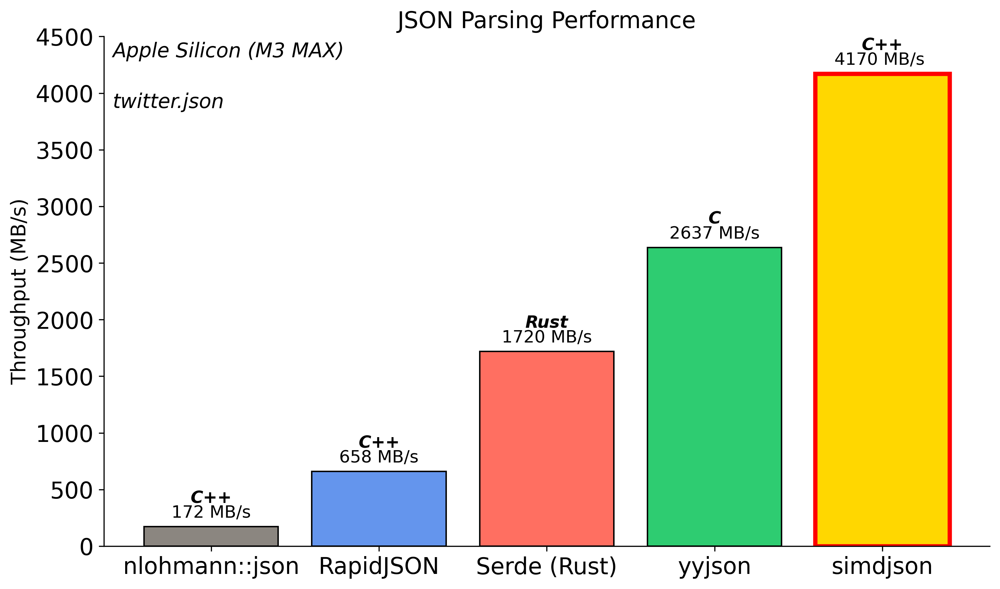

# C++26 Reflection for JSON Serialization
## A Practical Journey

- Daniel Lemire, *University of Quebec* :canada:
- Francisco Geiman Thiesen :brazil:, *Microsoft* :us:

CppCon 2025


---


# JSON

* Portable, simple
* Used by ~97% of API requests. [Landscape of API Traffic 2021 - Cloudflare](https://blog.cloudflare.com/landscape-of-api-traffic/#:~:text=We%20begin%20by%20examining%20the,first%20week%20of%20February%202021)
* scalar values
  * strings (must be escaped)
  * numbers (but not `NaN` or `Inf`)
* composed values
  * objects (key/value)
  * arrays (list)


---

# JSON Downside?

Reading and writing JSON can be *slow*. E.g., 100 MB/s to 300 MB/s.

- Slower than fast disks or fast networks

```bash
$ go run parse_twitter.go
Parsed 0.63 GB in 6.961 seconds (90.72 MB/s)
```


---

<style scoped>
img[alt~="center"] {
  display: block;
  margin: 0 auto;
}
</style>


Source: Gwen (Chen) Shapira


---


---

# Parsing at Gigabytes per Second

* simdjson was the first library to break the gigabyte per second barrier
    * Parsing Gigabytes of JSON per Second, VLDB Journal 28 (6), 2019
    * On-Demand JSON: A Better Way to Parse Documents? SPE 54 (6), 2024
* JSON for Modern C++ (nlohmann/json) can be $10\times$ slower!


---


## SIMD (Single Instruction, multiple data)

* Allows us to process 16 (or more) bytes or more with one instruction
* Supported on all modern CPUs (phone, laptop)
* Data-parallel types (SIMD) (recently added to C++26)

---

# Not All Processors are Equal

<style>
.center-table {
  display: flex;
  justify-content: center;
}
</style>

<div class="center-table">

| processor       | year    | arithmetic logic units    | SIMD units     |
|-----------------|---------|---------------------------|----------------|
| Apple M*        |  2019   |    6+                     | $4 \times 128$ |
| Intel Lion Cove |  2024   |    6                      | $4 \times 256$ |
| AMD Zen 5       |  2024   |    6                      | $4 \times 512$ |

</div>

---


# SIMD Support in simdjson

* x64: SSSE3 (128-bit), AVX-2 (256-bit), AVX-512 (512-bit)
* ARM NEON
* POWER (PPC64)
* Loongson: LSX (128-bit) and LASX (256-bit)
* RISC-V: *upcoming*

---


# simdjson: Design


* First scan identifies the structural characters, start of all strings at about 10 GB/s using SIMD instructions.
* Validates Unicode at 30 GB/s.
* Rest of parsing relies on the generated index.
* Allows fast skipping. (Only parse what we need)
* Can minify JSON at 10 to 20 GB/s

---


https://openbenchmarking.org/test/pts/simdjson


---

# Usage

**You are probably using simdjson:**

- Node.js, Electron,...
- ClickHouse
- WatermelonDB, Apache Doris, Meta Velox, Milvus,  QuestDB,  StarRocks

 


---

# The Problem

Imagine you're building a game server that needs to persist player data.


---

You start simple:

```cpp
struct Player {
    std::string username;
    int level;
    double health;
    std::vector<std::string> inventory;
};
```


---

# The Traditional Approach: Manual Serialization

Without reflection, you may write this tedious code:

```cpp
// Serialization - converting Player to JSON
fmt::format(
        "{{"
        "\"username\":\"{}\","
        "\"level\":{},"
        "\"health\":{},"
        "\"inventory\":{}"
        "}}",
        escape_json(p.username),
        p.level,
        std::isfinite(p.health) ? p.health : -1.0,
        p.inventory| std::views::transform(escape_json)
);
```

---

# Manual Deserialization (simdjson)

<!-- The code was really painful to read, this is probably sufficient. -->
```cpp
object obj = val.get_object();
p.username = obj["username"].get_string();
p.level = obj["level"].get_int64();
p.health = obj["health"].get_double();
array arr = obj["inventory"].get_array();
for (auto item : arr) {
    p.inventory.emplace_back(item.get_string());
}
```

---


# When Your Game Grows...

```cpp
struct Equipment {
    std::string name;
    int damage; int durability;
};
struct Achievement {
    std::string title; std::string description; bool unlocked;
    std::chrono::system_clock::time_point unlock_time;
};
struct Player {
    std::string username;
    int level; double health;
    std::vector<std::string> inventory;
    std::map<std::string, Equipment> equipped;     // New!
    std::vector<Achievement> achievements;         // New!
    std::optional<std::string> guild_name;         // New!
};
```


---

# Happy programmer...


---

# The Pain Points

This manual approach has several problems:

1) **Maintenance Nightmare**: Add a new field? Update both functions!
2) **Error-Prone**: Typos in field names, forgotten fields, type mismatches

---

# Our goal: Seamless Serialization/Deserialization


---

<!-- _class: centered -->
<style scoped>
section {
  text-align: center;
  font-size: 10em;
}
</style>

<p style="text-align:center">How do other languages do it?</p>

---

# C#

```C#

string jsonString = JsonSerializer.Serialize(player, options);


Player deserializedPlayer = JsonSerializer.Deserialize<Player>(jsonInput, options);
```


---

# How can C# Implementation be so Elegant?
It is using **reflection** to access the attributes of a struct during runtime.

---

# Rust (serde)

```rust
#[derive(Serialize, Deserialize)] // Annotation is required
pub struct player {}

// Rust with serde
let json_str = serde_json::to_string(&player)?;
let player: Player = serde_json::from_str(&json_str)?;
```


---


# Rust Reflection

* Rust does not have any built-in reflection capabilities.
* Serde relies on annotation and macros.


---


# Reflection as Accessing the Attributes of a Structure

<div class="center-table">

| language | runtime reflection | compile-time reflection |
|:---------|:-------------------|:------------------------|
| C++ 26   |       ❌            |       ✅                |
| Go       |       ✅            |       ❌                |
| Java     |       ✅            |       ❌                |
| C#       |       ✅            |       ❌                |
| Rust     |       ❌            |       ❌   (macros)     |

</div>

---

# Now it's our Turn to Have Reflection!

<!-- TODO: maybe add a reference to one of Herb's talks -->

With C++26 reflection and simdjson, **all that boilerplate disappears**:

```cpp
// Just define your struct - no extra code needed!
struct Player {
    std::string username;
    int level;
    double health;
    std::vector<std::string> inventory;
    std::map<std::string, Equipment> equipped;
    std::vector<Achievement> achievements;
    std::optional<std::string> guild_name;
};
```

---

# Automatic Serialization

```cpp
// Serialization - one line!
void save_player(const Player& p) {
    std::string json = simdjson::to_json(p);  // That's it!
    // Save json to file...
}
```

---

# Automatic Deserialization

```cpp
// Deserialization - one line!
Player load_player(std::string& json_str) {
    return simdjson::from(json_str);  // That's it!
}
```

Runnable example at https://godbolt.org/z/Efr7bK9jn

---

# Benefits of our implementation

* **No manual field mapping**
* **Minimal maintenance burden**
* **Handles nested and user-defined structures and containers automatically**
* **You can still customize things if and when you want to**

---

# What Happens Behind the Scenes

```cpp
// What you write:
Player p = simdjson::from(runtime_json_string);

// What reflection generates at COMPILE TIME (conceptually):
Player deserialize_Player(const json& j) {
    Player p;
    p.username = j["username"].get<std::string>();
    p.level = j["level"].get<int>();
    p.health = j["health"].get<double>();
    p.inventory = j["inventory"].get<std::vector<std::string>>();
    // ... etc for all members
    return p;
}
```

---

# The Actual Reflection Magic

```cpp
// Simplified snippet, members stores information about the class
// obtained via std::define_static_array(std::meta::nonstatic_data_members_of(^^T, ...))...
ondemand::object obj;

template for (constexpr auto member : members) {
    // These are compile-time constants
    constexpr std::string_view field_name = std::meta::identifier_of(member);
    constexpr auto member_type = std::meta::type_of(member);

    // This generates code for each member
    obj[field_name].get(out.[:member:]);
}
```

See full implementation on [GitHub](https://github.com/simdjson/simdjson/blob/8aae14931d4f3cb0ef529ba5f7e2e34d7bcc8e19/include/simdjson/generic/ondemand/std_deserialize.h#L290)

---

# Compile-Time vs Runtime: What Happens When

```cpp
struct Player {
    std::string username;    // ← Compile-time: reflection sees this
    int level;               // ← Compile-time: reflection sees this
    double health;           // ← Compile-time: reflection sees this
};

// COMPILE TIME: Reflection reads Player's structure and generates:
// - Code to read "username" as string
// - Code to read "level" as int
// - Code to read "health" as double

// RUNTIME: The generated code processes actual JSON data
std::string json = R"({"username":"Alice","level":42,"health":100.0})";
Player p = simdjson::from(json);
// Runtime values flow through compile-time generated code
```

---

Try out this example at https://godbolt.org/z/WWGjhnjWW

```cpp
struct Meeting {
    std::string title;
    long long start_time;
    std::vector<std::string> attendees;
    std::optional<std::string> location;
    bool is_recurring;
};

// Automatically serializable/deserializable!
std::string json = simdjson::to_json(Meeting{
    .title = "CppCon Planning",
    .start_time = std::chrono::duration_cast<std::chrono::milliseconds>(
        std::chrono::system_clock::now().time_since_epoch()
    ).count(),
    .attendees = {"Alice", "Bob", "Charlie"},
    .location = "Denver",
    .is_recurring = true
});

Meeting m = simdjson::from(json);
```


---

# The Container Challenge

We can say that serializing/parsing the basic types and custom classes/structs is pretty much effortless.

How do we automatically serialize ALL these different containers?

* `std::vector<T>`, `std::list<T>`, `std::deque<T>`
* `std::map<K,V>`, `std::unordered_map<K,V>`
* `std::set<T>`, `std::array<T,N>`
* Custom containers from libraries
* **Future containers not yet invented**

---

# The Naive Approach


```cpp
// The OLD way - repetitive and error-prone! 😱
void serialize(string_builder& b, const std::vector<T>& v) { /* ... */ }
void serialize(string_builder& b, const std::list<T>& v) { /* ... */ }
void serialize(string_builder& b, const std::deque<T>& v) { /* ... */ }
void serialize(string_builder& b, const std::set<T>& v) { /* ... */ }
// ... 20+ more overloads for each container type!
```

**Problem**: New container type? Write more boilerplate!

---

# The Solution: Concepts as Pattern Matching

Concepts let us say: **"If it walks like a duck and quacks like a duck..."**

```cpp
template <typename T>
concept container =
    requires(T a) {
      { a.size() } -> std::convertible_to<std::size_t>;
      {
        a[std::declval<std::size_t>()]
      }; // check if elements are accessible for the subscript operator
    };
```

---

# Containers, but not string types

```cpp
template <typename T>
concept container_but_not_string =
    requires(T a) {
      { a.size() } -> std::convertible_to<std::size_t>;
      {
        a[std::declval<std::size_t>()]
      }; // check if elements are accessible for the subscript operator
    } && !std::is_same_v<T, std::string> &&
    !std::is_same_v<T, std::string_view> && !std::is_same_v<T, const char *>;
```

---

```cpp
template <class T>
  requires(container_but_not_string<T>)
constexpr void atom(string_builder &b, const T &t) {
  if (t.size() == 0) {
    b.append_raw("[]");
    return;
  }
  b.append('[');
  atom(b, t[0]);
  for (size_t i = 1; i < t.size(); ++i) {
    b.append(',');
    atom(b, t[i]);
  }
  b.append(']');
}
```

✅ Works with `vector`, `array`, `deque`, custom containers...


---

```cpp
template <typename T>
concept appendable_containers =
    (details::supports_emplace_back<T> || details::supports_emplace<T> ||
    details::supports_push_back<T> || details::supports_push<T> ||
    details::supports_add<T> || details::supports_append<T> ||
    details::supports_insert<T>);
```

---

# Concepts + Reflection = Automatic Support

When you write:
```cpp
struct GameData {
    std::vector<int> scores;           // Array-like → [1,2,3]
    std::map<string, Player> players;  // Map-like → {"Alice": {...}}
    MyCustomContainer<Item> items;     // Your container → Just works!
};
```

The magic:
1) **Reflection** discovers your struct's fields
2) **Concepts** match container behavior to serialization strategy
3) **Result**: MOST containers work automatically - standard, custom, or future!

**Write once, works everywhere™**

---


---

# How fast are we?


---

**3.4 GB/s** - 14x faster than nlohmann, 2.5x faster than Serde!

---





---

# Serialization Ablation Study
## How We Achieved 3.4 GB/s

**What is Ablation?**
From neuroscience: systematically remove parts to understand function

**Our Approach (Apple Silicon M3 MAX):**
1) **Baseline**: All optimizations enabled (3,400 MB/s)
2) **Disable one optimization** at a time
3) **Measure performance impact**
4) **Calculate contribution**: `(Baseline - Disabled) / Disabled`

---

# Three Key Optimizations

1) **Consteval**: Compile-time field name processing
2) **SIMD String Escaping**: Vectorized character checks
3) **Fast Integer Serialization**: Optimized number handling


---

# Combined Performance Impact

<div class="center-table">

| Optimization | Twitter Contribution | CITM Contribution |
|--------------|---------------------|-------------------|
| **Consteval** | +100% (2.00x) | +141% (2.41x) |
| **SIMD Escaping** | +42% (1.42x) | +4% (1.04x) |
| **Fast Digits** | +6% (1.06x) | +34% (1.34x) |
</div>

---

# Optimization #1: Consteval
## The Power of Compile-Time

**The Insight:** JSON field names are known at compile time!

**Traditional (Runtime):**
```cpp
// Every serialization call:
write_string("\"username\"");  // Quote & escape at runtime
write_string("\"level\"");     // Quote & escape again!
```

**With Consteval (Compile-Time):**
```cpp
constexpr auto username_key = "\"username\":";  // Pre-computed!
b.append_literal(username_key);  // Just memcpy!
```


---

# Optimization #2: SIMD String Escaping

**The Problem:** JSON requires escaping `"`, `\`, and control chars

**Traditional (1 byte at a time):**
```cpp
for (char c : str) {
    if (c == '"' || c == '\\' || c < 0x20)
        return true;
}
```

**SIMD (16 bytes at once):**
```cpp
auto chunk = load_16_bytes(str);
auto needs_escape = check_all_conditions_parallel(chunk);
if (!needs_escape)
    return false;  // Fast path!
```

---

# Optimization #3: Fast Integer serialization

* Use the equivalent of `std::to_chars`
* Could use SIMD if we wanted to
  * "Converting integers to decimal strings faster with AVX-512," in Daniel Lemire's blog, March 28, 2022, https://lemire.me/blog/2022/03/28/converting-integers-to-decimal-strings-faster-with-avx-512/.
* Replace fast digit count by naive approach based on `std::to_string`
    ```cpp
    std::to_string(value).length();
    ```
* Only 34% worse in one dataset.

---


# What about compilation time?

We've observed a 6% slow-down when compiling simdjson with static reflection enabled. (clang p2996 experimental branch).

---


# Key Technical Insights

1) **With reflection and concepts**, code is shorter and more general

2) **Fast compile time**

3) **Compile-Time optimizations can be awesome**

4) **SIMD**: String operations benefit

5) **Many optimization helps**

---

# Thank You!

**C++ Reflection Paper Authors**
- The authors of P2996 for making compile-time reflection a reality

**Compiler Implementation Teams**
- Everyone that implemented P2996 and made it publicly available.
- Early adopters testing and providing feedback

**Compiler Explorer Team**
- Matt Godbolt and contributors

**simdjson Community**
- All contributors and users (John Keiser, Geoff Langdale, Paul Dreik...)

---


# Questions?

Daniel Lemire and Francisco Geiman Thiesen

GitHub: github.com/simdjson/simdjson

Thank you!

---
